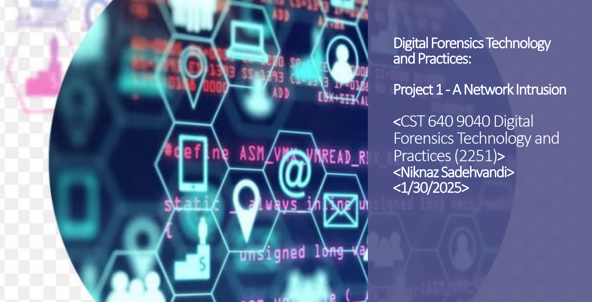

# 💼 Project 1 – A Network Intrusion (Digital Forensics Presentation)

**Course:** CST 640 – Digital Forensics Technology and Practices (UMGC)  
**Author:** Niknaz Sadehvandi  
**Date:** January 30, 2025  

---

## 🧩 Overview
This project is a **PowerPoint presentation** that explores a simulated **network intrusion investigation** in a controlled digital forensics lab (MARS environment).  
It focuses on identifying vulnerabilities, decoding Base64-encoded passwords, and correcting web server misconfigurations to prevent unauthorized access.

---

## 🧠 Tools & Technologies
- 🐧 Kali Linux (MARS)
- 💻 Windows Server (IIS)
- 🔍 Dirb | Nmap | Nikto
- 🧮 CyberChef (for Base64 decoding)
- ⚙️ `net user` and `net localgroup` commands

---

## ⚙️ Key Objectives
1. Analyze a vulnerable IIS web server configuration.  
2. Perform reconnaissance using Dirb to locate hidden directories.  
3. Decode exposed Base64 credentials to reveal user information.  
4. Apply mitigation techniques to strengthen server security.  

---

## 📄 Project Slides / Report
📘 [View or Download Presentation (PDF)](Digital-Forensics-Project1-Network-Intrusion.pdf)

---

## 🖼️ Screenshot Highlights (Placeholders)

| Screenshot | Description |
|-------------|-------------|
|  | MARS Linux environment used for security testing |
|  | Example of Dirb scan showing hidden directories |
|  | Base64 decoding of exposed credentials |
|  | Misconfigured IIS server leading to exposure |

> 💡 Tip: You can create an `images/` folder in your repo and upload screenshots from your PowerPoint slides to replace these placeholders.

---

## 🧑‍💻 Skills Demonstrated
- Network Vulnerability Assessment  
- Web Server Forensics  
- Incident Analysis & Reporting  
- Threat Detection and Mitigation  
- Base64 Data Decoding and Credential Recovery  

---

## 🛡️ References
- [NIST Cybersecurity Framework 2.0](https://nvlpubs.nist.gov/nistpubs/CSWP/NIST.CSWP.29.pdf)  
- [CISA Cybersecurity Best Practices](https://www.cisa.gov/topics/cybersecurity-best-practices)  
- [GeeksforGeeks – Base64 Encoding in Python](https://www.geeksforgeeks.org/encoding-and-decoding-base64-strings-in-python/)  
- [Trellix – Decoding the DNA of Ransomware Attacks](https://www.trellix.com/blogs/research/decoding-the-dna-of-ransomware-attacks/)  

---

**© 2025 Niknaz Sadehvandi | University of Maryland Global Campus**

